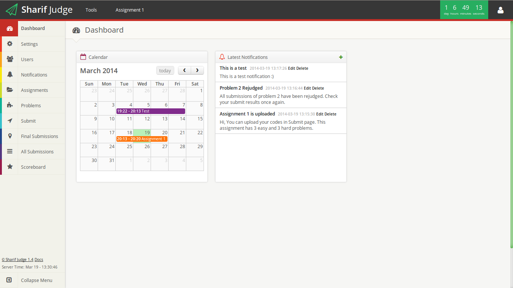

Sharif Judge
============

[Sharif Judge](https://github.com/mjnaderi/Sharif-Judge) is a free and open source online judge for C, C++, Java and Python programming courses.

The web interface is written in PHP (CodeIgniter framework) and the main backend is written in BASH.

Python in Sharif Judge is not sandboxed yet. Just a simple (low) level of security is provided for python. If you want to use Sharif Judge for python, USE IT AT YOUR OWN RISK or provide sandboxing yourself.

Features
========

  * [Multiple user roles](link) (admin, head instructor, instructor, student)
  * [Sandboxing](link)
  * [Cheat detection](link) (similar codes detection) using [Moss](http://theory.stanford.edu/~aiken/moss/)
  * Custom rule for grading late submissions
  * Submission queue
  * Download results in excel file
  * Download submitted codes in zip file
  * `Output Comparison` and `Tester` methods for checking output correctness
  * Add multiple users
  * Rejudge
  * Scoreboard
  * Notifications
  * ...

Documentation
===============

  * [Sharif Judge v1.4 Documentation](v1.4)
