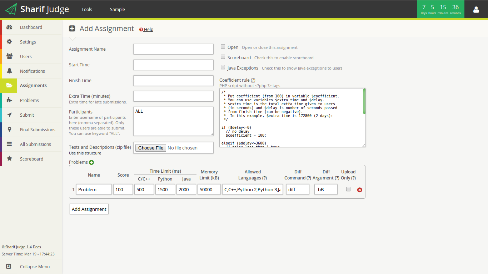

Add Assignment
==============

See [Sample Assignment](sample_assignment.md) to learn and test adding assignments by adding a sample assignment.

You can add a new assignment by clicking on "Add" in "Assignments" page. You will see this page:



There are several settings in "Add Assignment" page:

Assignment Name
---------------

The assignment will be shown with this name in list of assignments.

Start Time
----------

Users will not be able to submit before "Start Time".

Use this format for start time: `MM/DD/YYYY HH:MM:SS` e.g. `08/31/2013 12:00:00`

Finish Time, Extra Time
-----------------------

Users will not be able to submit after `Finish Time + Extra Time`.

Late submissions (submissions in extra time) will be multiplied by a coefficient. You should write a PHP script for calculating the coefficient in "Coefficient Rule" field.

Use this format for finish time: `MM/DD/YYYY HH:MM:SS` e.g. `08/31/2013 23:59:59`

Extra time must be in minutes. You can use `*`.  e.g. `120` (2 hours) or `48*60` (2 days)

Participants
------------

Enter usernames of participants here (comma separated). Only these users are able to submit. You can use keyword `ALL` for allowing all users to submit.

e.g.

    admin, instructor1 , instructor2 ,student1  ,   student2,student3 , student4

Tests
-----

You can upload test cases in a zip file with [this structure](tests_structure.md).

Open
----

You can open or close the assignment for students using this option. If you close the assignment, non-student users will still be able to submit.

Scoreboard
----------

You can enable or disable scoreboard for the assignment using this option.

Java Exceptions
---------------

You can enable or disable showing java exceptions to students. Changing this option does not affect previously judged codes.

The exception name will be shown only if `tester/java_exceptions_list` contains that name.

If you enable this feature, something like this will be displayed to students when an exception is thrown:

    Test 1
    ACCEPT
    Test 2
    Runtime Error (java.lang.ArrayIndexOutOfBoundsException)
    Test 3
    Runtime Error (java.lang.ArrayIndexOutOfBoundsException)
    Test 4
    ACCEPT
    Test 5
    ACCEPT
    Test 6
    ACCEPT
    Test 7
    ACCEPT
    Test 8
    Runtime Error (java.lang.ArrayIndexOutOfBoundsException)
    Test 9
    Runtime Error (java.lang.StackOverflowError)
    Test 10
    Runtime Error (java.lang.ArrayIndexOutOfBoundsException)

Coefficient Rule
----------------

You can write a PHP script here that calculates the coefficient multiplied by scores.
Your script must put coefficient (from 100) in variable `$coefficient`. You can use variables `$extra_time` and `$delay`. `$extra_time` is the total extra time given to users in seconds (the extra time that you entered in Extra Time field) and `$delay` is number of seconds passed from finish time (can be negative).

This PHP script should not contain `<?php` , `<?` , `?>` tags.

In this example, $extra_time is 172800 (2 days):

```php
if ($delay<=0)
  // no delay
  $coefficient = 100;

elseif ($delay<=3600)
  // delay less than 1 hour
  $coefficient = ceil(100-((30*$delay)/3600));

elseif ($delay<=86400)
  // delay more than 1 hour and less than 1 day
  $coefficient = 70;

elseif (($delay-86400)<=3600)
  // delay less than 1 hour in second day
  $coefficient = ceil(70-((20*($delay-86400))/3600));

elseif (($delay-86400)<=86400)
  // delay more than 1 hour in second day
  $coefficient = 50;

elseif ($delay > $extra_time)
  // too late
  $coefficient = 0;
```

Problems


Enter information about problems in this field. There are several items in this field.

Name
-----

The name of problem.

Score
-----

The score of problem.

Time Limit
----------

You can set a time limit in milliseconds for running codes. Python and Java are usually slower than C/C++. So they need more time.

Memory Limit
------------

Set memory limit in kilobytes. This memory limit is not very accurate.

Allowed Languages
-----------------

Set allowed languages for each problems in this field (comma separated).

Available languages are: `C`, `C++`, `Java`, `Python 2`, `Python 3`, `Zip`, `PDF`

Note: You can use `Zip` or `PDF` only if you have enabled `Upload Only` option.

e.g. `C, C++   , Zip` or `Python 2,Python 3` or `Java ,C`

Diff Command
------------

The command used to compare output with correct output. By default Sharif Judge uses `diff`. But you can change this command here.

This field should not contain any space.

Diff Arguments
--------------

You can set arguments of Diff command here. See `man diff` for a complete list of available `diff` arguments.

I have added two new options: `ignore` and `identical`.

  * **`ignore`**: Sharif Judge ignores all newlines and whitespaces.
  * **`identical`**: Sharif Judge doesn't ignore anything. Output of submitted file must be identical to the test case's output to be accepted.

This field should not contain any space. You may consider using `-b`, `-bB`, `-iw` or `ignore`.

Upload Only
-----------

If you set a problem as Upload-Only, Sharif Judge will not judge submissions of that problem. You can use `Zip` and `PDF` in allowed languages if you have enabled this option.
